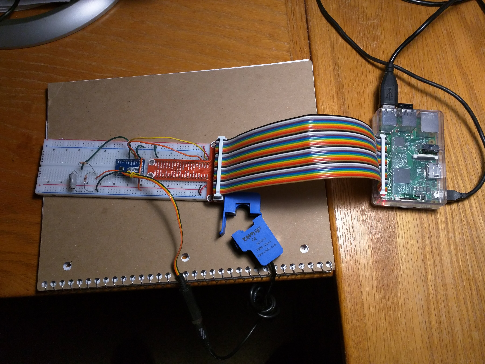

#Monitoring Home Energy with your Raspberry Pi

This software is designed to work with a hardware project [documented at Hackster.io](https://www.hackster.io/michael-nigbor/homeenergy-pi-cecfdf)

The centerpice of the design is an ADC1115 analog-to-digital controller, which used I2C to communicate with the RPi.

The software consists of three parts

1. A python script that measures current and saves the readings to a database

2. A python script that transmits measurements to a destination in the cloud

3. A simple sqlite3 database



##Prerequisites

A Raspberry Pi.  I did my development on a Raspberry Pi Model 2 B. I suspect this will work fine on newer models.

Python 3 - This is probably already installed.  If not, use sudo apt-get install python3 

SQLite 3 - Install this using sudo apt-get install sqlite3 

##Configuration
Configuration is stored in the HomeEnergy.json file. There are two sections, one for the sampler and another for
transmitter.

The A, B, C and gain values are calibration values that convert the voltages read by the ADC into amps.  They
should be close, but if you use a different current sensor or your readings are off, you may need to adjust them.
The values are the coefficients for a polynomial regression.

```
{
  "Database": "/home/pi/HomeEnergy/HomeEnergy.db",
  "Sampler": 
  {
    "A": 0.1051,
    "B": 0.00324,
    "C": 0.0000011614,
    "gain": 1
  },
  "Transmitter":
  {
      "loginURL": "DESTINATION URL HERE",
      "currentURL": "DESTINATION URL HERE",
      "userName": "USERNAME HERE",
      "password": "PASSWORD HERE"
  }
}
```
##Sampler.py
The sampler Python script is designed to be run by cron. Fortunately, the Pi has a GUI for configuring cron jobs.

The sampler takes measurements from the ADC, calculates RMS and then saves the resulting value into the database. 
It takes one sample and then exits. 

On my system, the sampler runs every minute.

##Transmitter.py

The transmitter Python script is also designed to by run as a cron job.  It reads up to 20 records from the databases
and transmits them to the web destination.  It sends JSON that looks like this:
```
{
   'readingdate' : '2018-03-03T16:12:00',
   'current1' : 0.0,
   'current2' : 0.0
}
```
The readingdate field is in ISO format.  Most homes have two hot leg, so there are two current readings.

The transmitter expects to send a user ID and password to a web service and get an access token in return.  It sends
the token on all subsequent requests.

##Web Destination
The idea behind the web destination is that you'll want to see the values produced by the system as graphs, gauges
charts.

If you want to build your own web destination, the only requirements are:
1. A web service that accepts a user ID/password and returns an access token
2) A web service that accepts an HTTP POST and a body of the format shown above.

I'm working on a Node-based web application that will do this. This application is designed to run on
a "micro" server on Amazon, Google or Azure. This will make readings accessible on your phone or web browser no 
matter where you are.  The application shows the current readings but also produces several graphs and bar charts.

This application should also run fine right on your Pi, though it won't be accessible to the Internet 
unless you open holes in your firewall (something I didn't want to do).

It should be published in another repo soon.